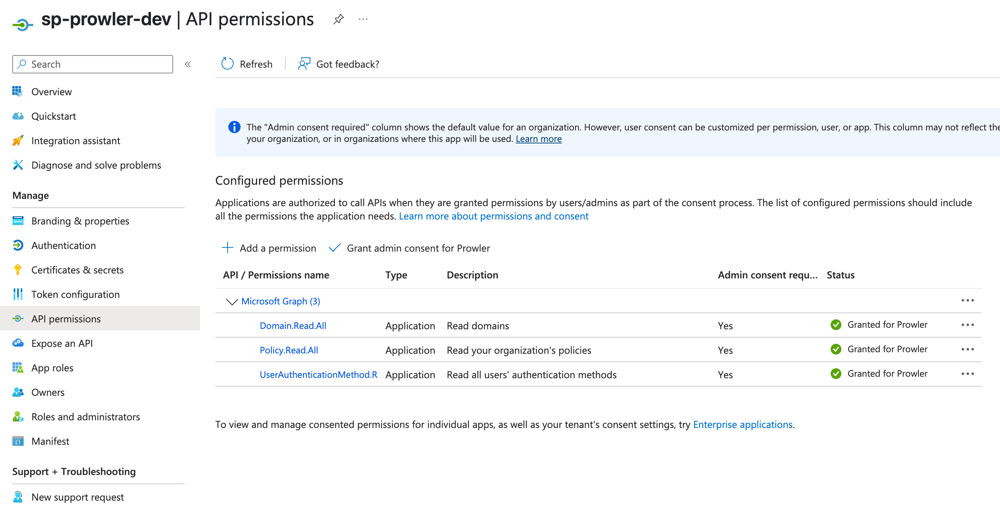

# Creating a Prowler Service Principal Application

To enable Prowler to assume an identity for scanning with the required privileges, a Service Principal must be created. This Service Principal authenticates against Azure and retrieves necessary metadata for checks.

### Methods for Creating a Service Principal

Service Principal Applications can be created using either the Azure Portal or the Azure CLI.

## Creating a Service Principal via Azure Portal / Entra Admin Center

   1. Access Microsoft Entra ID.
   2. In the left menu bar, navigate to “App registrations”.
   3. Click “+ New registration” in the menu bar to register a new application
   4. Fill the “Name”, select the “Supported account types” and click “Register”. You will be redirected to the applications page.
   5. In the left menu bar, select “Certificates \& secrets”.
   6. Under the “Certificates \& secrets” view, click “+ New client secret”.
   7. Fill the “Description” and “Expires” fields, then click “Add”.
   8. Copy the secret value, as it will be used as `AZURE_CLIENT_SECRET` environment variable.


## From Azure CLI

### reating a Service Principal

To create a Service Principal using the Azure CLI, follow these steps:

   1. Open a terminal and execute the following command:

   ```console
   az ad sp create-for-rbac --name "ProwlerApp"
   ```

   2. The output will be similar to:

   ```json
   {
   "appId": "XXXXXXXX-XXXX-XXXX-XXXX-XXXXXXXXXXXX",
   "displayName": "ProwlerApp",
   "password": "XXXXXXXXXXXXXXXXXXXXXXXXXXXXXXXXXXXXXXXX",
   "tenant": "XXXXXXXX-XXXX-XXXX-XXXX-XXXXXXXXXXXX"
   }
   ```

   3. Save the values of `appId`, `password` and `tenant`, as they will be used as credentials in Prowler.

# Assigning Proper Permissions

To allow Prowler to retrieve metadata from the assumed identity and run Entra checks, assign the following permissions:

   - `Directory.Read.All`
   - `Policy.Read.All`
   - `UserAuthenticationMethod.Read.All` (used only for the Entra checks related with multifactor authentication)

Permissions can be assigned via the Azure Portal or the Azure CLI.

???+ note
   After creating and assigning the necessary Entra permissions, follow this [tutorial](../azure/subscriptions.md) to add subscription permissions to the application and start scanning your resources.

## Assigning the Reader Role in Azure Portal

   1. Access Microsoft Entra ID.

   2. In the left menu bar, navigate to “App registrations”.

   3. Select the created application.

   4. In the left menu bar, select “API permissions”.

   5. Click “+ Add a permission” and select “Microsoft Graph”.

   6. In the “Microsoft Graph” view, select “Application permissions”.

   7. Finally, search for “Directory”, “Policy”, and “UserAuthenticationMethod”, and select the following permissions:

      - `Directory.Read.All`
      - `Policy.Read.All`
      - `UserAuthenticationMethod.Read.All`

   8. Click “Add permissions” to apply the new permissions.

   9. Finally, an admin must click “Grant admin consent for \[your tenant]” to apply the permissions.



## From Azure CLI

   1. To grant permissions to a Service Principal, execute the following command in a terminal:

   ```console
   az ad app permission add --id {appId} --api 00000003-0000-0000-c000-000000000000 --api-permissions 7ab1d382-f21e-4acd-a863-ba3e13f7da61=Role 246dd0d5-5bd0-4def-940b-0421030a5b68=Role 38d9df27-64da-44fd-b7c5-a6fbac20248f=Role
   ```

   2. Once the permissions are assigned, admin consent is required to finalize the changes. An administrator should run:

   ```console
   az ad app permission admin-consent --id {appId}
   ```
